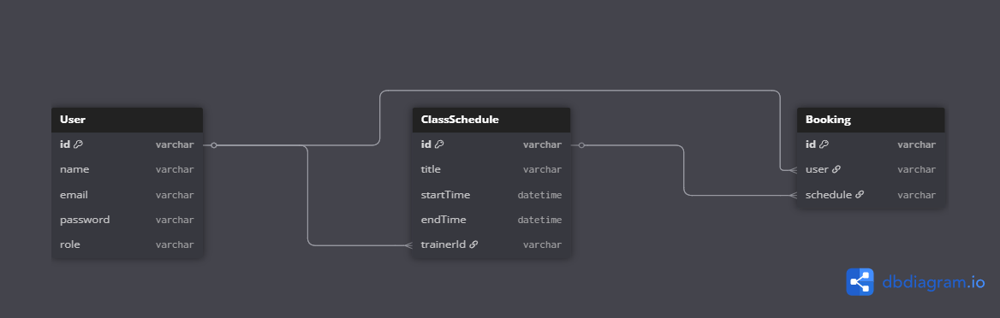

# Gym Management API

RESTful API for managing users, trainers, class schedules, and bookings in a gym.

### Live Base URL:

```
https://gym-management-server-liart.vercel.app/
```

### Live Docs: [Postman Collection](https://documenter.getpostman.com/view/44921584/2sB34kEKMH)

---

## ⚙️ Tech Stack

-   Node.js
-   Express.js
-   MongoDB + Mongoose
-   TypeScript
-   JWT Auth

---

### 🛂 Admin Credentials

Use the following credentials to access admin functionalities:

```bash
Email: admin@gymcampus.com
Password: AdminPass
```

---

## 🧪 Run Locally

1. **Clone repo:**

    ```bash
    git clone https://github.com/TheProjectsX/gym-management.git
    cd gym-management
    ```

2. **Install dependencies:**

    ```bash
    npm install
    ```

3. **Add `.env` file:**
   Create a `.env` file based on `.env.example` and add:

    ```
    MONGO_URI=
    JWT_SECRET=
    PORT=5000
    ```

4. **Run server:**

    ```bash
    npm run dev
    ```

---

## 🔒 Roles

-   **Admin** → Can manage users, assign trainers
-   **Trainer** → Can view their class schedules
-   **Trainee (User)** → Can book classes

---

## 🧱 Models

### User

```ts
{
  name: String,
  email: String,
  password: String,
  role: 'admin' | 'trainer' | 'trainee' (default: 'trainee')
}
```

### ClassSchedule

```ts
{
  title: String,
  startTime: Date,
  endTime: Date,
  trainer: ObjectId → User
}
```

### Booking

```ts
{
  user: ObjectId → User,
  schedule: ObjectId → ClassSchedule
}
```

---

## 🧭 API Docs

All routes are documented here:
📬 **[Postman API Documentation](https://documenter.getpostman.com/view/44921584/2sB34kEKMH)**

---

## 🔗 Relational Diagram (placeholder)



---

## 🧪 Testing Instructions

To test key features, log in with admin credentials to receive an **HTTP-only cookie** for authentication. This cookie must be sent with all requests.

### Create a Trainer

-   **Endpoint:** `POST /api/admin/trainer/upgrade`
-   **Cookie:** Logged in as **admin**
-   **Body:**

```json
{
    "id": "USER_ID"
}
```

### Schedule a Class

-   **Endpoint:** `POST /api/admin/schedules/new`
-   **Cookie:** Logged in as **admin**
-   **Body:**

```json
{
    "title": "Cardio Class",
    "trainerId": "TRAINER_ID",
    "startTime": "2025-07-21T10:00:00.000Z"
}
```

### Book a Class

-   **Endpoint:** `POST /api/users/me/schedules/book`
-   **Cookie:** Logged in as **trainee**
-   **Body:**

```json
{
    "id": "SCHEDULE_ID"
}
```

### Notes

-   Auth is handled via **HTTP-only cookies**, not Bearer tokens.
-   A clean database is provided with only the **admin user** initially.
-   See Postman docs for full route details and examples.
